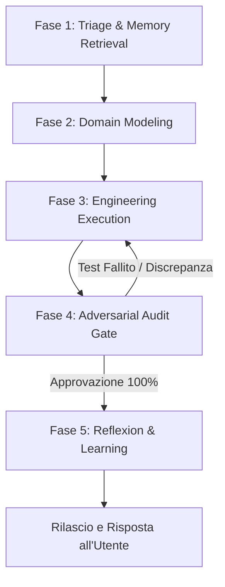

# WORKFLOW: Multiagent Harness Workflow

Questo workflow definisce il protocollo operativo a 5 fasi che l'**Orchestratore** e i **Subagenti Specializzati** devono eseguire per ogni richiesta di modifica o estensione dell'applicazione.

---

## Fase 1: Task Triage & Memory Retrieval
- **Responsabile:** `Comitato_Orchestrator`
- **Azione:**
  1. Analizza la richiesta dell'utente e identifica i domini coinvolti (Fisico, Fiscale, Bancario, Frontend, Excel).
  2. Consulta la cartella `.agents/memory/`:
     - Legge `semantic_grounding.md` per estrarre le definizioni normative e matematiche certe.
     - Ispeziona `episodic_case_history.json` e `learned_rules.md` per verificare se l'area toccata ha precedenti di bug o allucinazioni (es. IVA a Dicembre, debito datato, formule circolari).
  3. Inietta le regole procedurali pertinenti nel prompt dei subagenti assegnati.

---

## Fase 2: Domain Modeling (Specifiche Specialistiche)
- **Responsabili:** `energy_expert`, `fiscal_expert`, `finance_modeler`
- **Azione:**
  - `energy_expert`: formalizza la produzione solare (PVGIS), le perdite di rete (+2.3% MT / +5.2% BT) e i vincoli termici BESS (max 35°C, max 3.5%/anno SoH decay).
  - `fiscal_expert`: determina il regime IVA (reverse charge vs ordinaria), il trattamento ammortamenti (OIC 16 / Art. 102 TUIR), il riporto perdite (Art. 84) e il meccanismo F24/TR.
  - `finance_modeler`: definisce la formula di ammortamento debito, la quota interessi Act/360, il preammortamento (quota capitale = 0) e la cascata waterfall SPV vs Holding.

---

## Fase 3: Engineering Execution
- **Responsabile:** `code_engineer`
- **Azione:**
  1. Esegue le modifiche al motore di calcolo (`src/worker/simulation.worker.js`).
  2. **Regola Bloccante:** esegue `node -c src/worker/simulation.worker.js` da terminale.
  3. Aggiorna l'interfaccia utente (`index.html`, `src/main.js` con binding `domMap` ed event listeners).
  4. Aggiorna l'esportazione Excel (`src/excelExport.js`), garantendo formule pure con precomputed result ed escludendo dipendenze circolari.
  5. Invalida la cache dell'app shell: incrementa `main.js?v=N` in `index.html` e `CACHE_NAME` in `sw.js`.

---

## Fase 4: Adversarial Audit Gate (Verifica Avversaria Bloccante)
- **Responsabile:** `adversarial_auditor`
- **Azione:**
  L'auditor non scrive codice applicativo; esegue una batteria di test bloccante con attitudine da revisore implacabile:
  1. `node tests/financial_invariants_suite.mjs` (verifica delle 10 invarianti di bilancio su 5 scenari operativi).
  2. `node tests/test_worker.mjs` (216+ test unitari di regressione).
  3. `node tests/test_excel_export.mjs` (verifica 100% dell'integrità formule native Excel).
  - **Se anche un solo test fallisce:** l'Auditor rigetta il lavoro, identifica l'invariante violata e rimanda l'esecuzione alla Fase 3 con il dettaglio dell'errore.
  - **Se tutti i test superano:** l'Auditor certifica la conformità e concede il via libera.

---

## Fase 5: Reflexion & Learning (Auto-Miglioramento Continuo)
- **Responsabili:** `Comitato_Orchestrator` e `adversarial_auditor`
- **Azione:**
  - Se durante il task è stato intercettato un bug logico, un disallineamento o un'allucinazione:
    1. Viene eseguito `.agents/scripts/auto_reflexion.mjs` per registrare il caso in `episodic_case_history.json`.
    2. Viene formalizzata una nuova regola vincolante in `learned_rules.md`.
    3. Viene creata o estesa una nuova asserzione nella suite di invarianti `tests/financial_invariants_suite.mjs`.
  - In questo modo, l'harness apprende permanentemente dai propri errori e garantisce che lo stesso disallineamento non possa mai più ripetersi.
