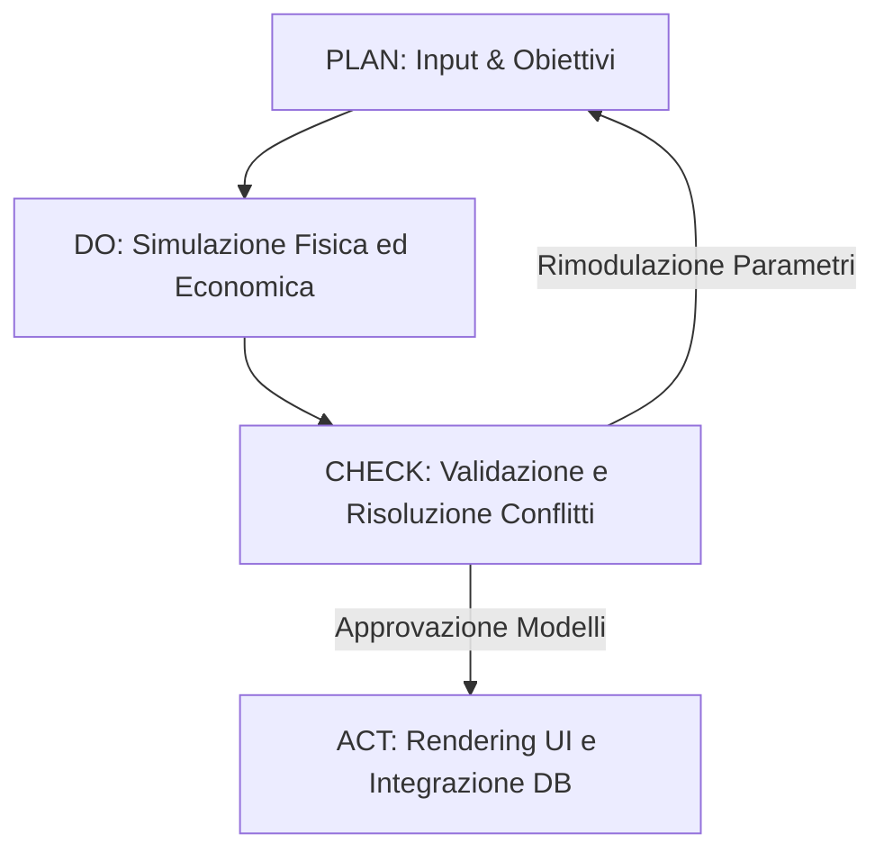

# WORKFLOW: SBTD Verification Cycle

Questo workflow definisce il ciclo di collaborazione e convergenza per la simulazione ibrida Fotovoltaico + BESS, garantendo che i modelli fisici, finanziari e di sviluppo convergano in modo coerente e senza errori.

## 1. PLAN (Pianificazione)
- **Responsabile:** `Comitato_Orchestrator`
- **Azione:** Raccolta dei requisiti dell'utente e impostazione dei parametri macroeconomici e di dimensionamento:
  - Definizione della capacità target del solare (MWp) e del BESS (MW/MWh).
  - Impostazione dei vincoli finanziari desiderati (LTV, WACC, tasso debito, inflazione).
  - Raccolta dei dati storici del PUN ed impostazione della geolocalizzazione per il tracciato PVGIS.
  - Selezione dello scenario di incentivazione (Standard PPA vs CER/CACER) ed eventuale attivazione del modulo regolatorio **cer.md**.

## 2. DO (Esecuzione della Simulazione)
- **Azione:** Gli specialisti eseguono i calcoli specialistici in parallelo:
  - **Agent_Energy_Developer:**
    - Esegue il parsing del tracciato PVGIS orario sull'anno 2025.
    - Genera la curva di carico stabilimento.
    - Seleziona la risoluzione temporale (quart'oraria per il default regolatorio TIDE 2026 o oraria per le simulazioni storiche) e applica le perdite convenzionali (+2.3% allacciamento MT, +5.2% BT) per l'energia immessa netta da **cer.md**.
    - Avvia l'ottimizzazione MILP per la carica/scarica BESS con esclusione reciproca.
    - Calcola l'invecchiamento delle celle (Calendar & Cycle aging) e determina la curva oraria del SoH.
  - **Agent_Financial_Modeler:**
    - Riceve i profili energetici orari/quart'orari.
    - Calcola i ricavi da GSE/RID e PPA, i costi di sbilanciamento e i ricavi di arbitraggio BESS.
    - Se attivo lo scenario CER, calcola il corrispettivo unitario di valorizzazione TIAD ($CACV_t = TRAS + cPR \times P_{z,t}$) e la tariffa premio MASE (decreto CACER) al netto di eventuali correzioni geografiche, applicando le formule di **cer.md**.
    - Struttura il conto economico (EBITDA, EBIT, EBT, Utile) orario e annuo su 20 anni.
    - Esegue il modulo fiscale con calcolo di IRES, IRAP ed applicazione dell'Art. 96 TUIR (capienza ROL).
  - **Agent_MA_Expert:**
    - Valuta la bancabilità del progetto: calcola DSCR, LLCR, Project IRR ed Equity IRR.
    - Se in scenario CER, verifica l'idoneità alla Facility PNRR 2026 (spese capitali fino al 40%, rispetto scadenze perentorie di allaccio) ed applica la decurtazione della tariffa premio tramite il fattore $F$ specificato in **cer.md**.
    - Dimensiona gli accantonamenti straordinari per la sostituzione delle batterie (Year 10-12).
    - Gestisce la strutturazione di Earn-out e Joint Venture.

## 3. CHECK (Controllo e Validazione)
- **Responsabile:** `Comitato_Orchestrator`
- **Azione:** Controllo dell'integrità e della convergenza tramite i protocolli impostati:
  - **Verifica Integrità Dati:** Confermare che tutti i vettori temporali contengano esattamente 8760 punti orari (o 35040 quart'orari) sincronizzati sull'anno di riferimento, senza lacune o NaN.
  - **Conformità e Separazione CER (cer.md):** Verificare l'assenza di double-counting dell'energia virtuale condivisa e assicurare la rigida separazione dei ricavi RID (SPV) ed energia condivisa (CER). Avvisare del gap di precisione (sovrastima del 3-7%) se si usa la risoluzione oraria invece che quart'oraria.
  - **Risoluzione Conflitto Termico-Economico:** Verificare se il SoH decade a un tasso annuo superiore al 3.5% o se la temperatura di cella eccede costantemente i 35°C. Se questo accade, viene data priorità assoluta alla tutela fisica della batteria, rimandando il modello ad `Agent_Energy_Developer` per una rimodulazione dell'ottimizzazione MILP (cariche/scariche meno aggressive).
  - **Verifica Bancabilità:** Se il DSCR minimo scende sotto la soglia di tolleranza bancaria (es: 1.15-1.20x), il modello viene rimandato alla fase di PLAN per correggere la leva (LTV) o allungare la durata del mutuo.

## 4. ACT (Rilascio e Integrazione)
- **Azione:** Una volta convalidati i modelli fisici e finanziari, si procede all'integrazione:
  - **Agent_Frontend_Engineer:**
    - Incorpora le matrici di dati nell'interfaccia utente interattiva (Single Page Application in `index.html`).
    - Configura Chart.js per il rendering fluido a 60 FPS con algoritmo di decimazione dati orari.
    - Esegue il caricamento asincrono della telemetria a Supabase tramite chunk da 1000 record con retry ed exponential backoff.
